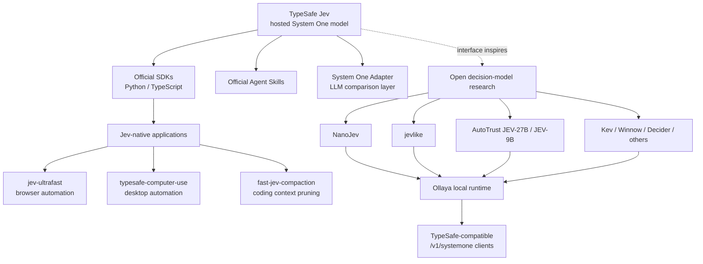
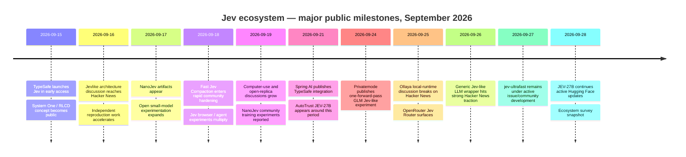
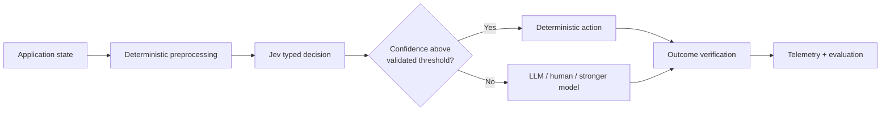

# The Awesome Jev Open-Source Ecosystem: Projects, Models, Integrations, and Developer Momentum

## Executive summary
> A field guide to the Jev ecosystem: typed decisions, fast agent loops, local runtimes, and open research.


TypeSafe AI’s **Jev ecosystem is one of the fastest-forming AI developer ecosystems I have seen, but it is also exceptionally young**. TypeSafe publicly launched Jev in early access on **September 15, 2026**, only about two weeks before this survey. Jev is TypeSafe’s first “System One Model”: instead of generating arbitrary text, it takes unstructured or structured state plus predefined questions and returns typed probabilistic decisions. TypeSafe says its stack combines a new model architecture, parallel sampling, and a training method it calls Reinforcement Learning for Calibrated Decisions, or RLCD.  [TypeSafe Jev launch](https://typesafe.ai/blog/introducing-system-one-models-and-jev)

A terminology point matters: **Jev itself is not an open-weights/open-source model in the material reviewed here**. The “Jev open-source ecosystem” consists of TypeSafe’s open SDKs, skills and comparison adapters plus a rapidly expanding independent community of Jev-powered applications, Jev-compatible runtimes, and Jev-like/open-weight models. AutoTrust’s JEV-27B documentation, for example, explicitly distinguishes the hosted TypeSafe Jev 1.13 teacher from its independent open-weights student and says the latter shares neither weights nor code with TypeSafe.  [JEV-27B model card](https://huggingface.co/autotrust/JEV-27B)

The clearest signals of developer heat as of **September 28, 2026** are extraordinary for such a young ecosystem:

| Standout | Current signal | Assessment |
|---|---:|---|
| **browser-use/jev-ultrafast** | **20.8k GitHub stars** | By far the breakout application; demonstrates an unusually fast browser-agent loop.  [Jev Ultrafast](https://github.com/browser-use/jev-ultrafast) |
| **fast-jev-compaction** | **7.0k stars** | Strongest coding-agent utility; uses Jev as a relevance filter for Claude Code history.  [fast-jev-compaction](https://github.com/tamaratran/fast-jev-compaction) |
| **NanoJev** | **2.4k stars** | Most visible small-model/open-training research reproduction.  [NanoJev](https://github.com/TianyuCodings/NanoJev) |
| **TypeSafe Agent Skills** | **2.3k stars** | Fast uptake of TypeSafe’s official agent-oriented developer entry point.  [TypeSafe Agent Skills](https://github.com/typesafe-ai/skills) |
| **awesome-jev** | **1.8k stars / 623 commits** | Evidence that discovery/curation demand is itself substantial.  [awesome-jev index](https://github.com/yibie/awesome-jev) |
| **jevlike** | **1.3k stars** | Especially useful because it exposes a simple, intelligible one-pass option-scoring architecture rather than claiming to reproduce TypeSafe’s private design.  [jevlike](https://github.com/vinnylarouge/jevlike) |
| **typesafe-computer-use** | **1.0k stars** | High-interest desktop-agent demonstration with explicit cost/latency instrumentation.  [typesafe-computer-use](https://github.com/awlevin/typesafe-computer-use) |
| **Ollaya** | **719 stars** | Arguably the most strategically important emerging project: a local TypeSafe-compatible runtime for multiple open decision models.  [Ollaya](https://github.com/ollaya-dev/ollaya) |

The ecosystem's center of gravity is already splitting into three layers. **Applications** such as Jev Ultrafast and typesafe-computer-use show what low-latency decision models change in agent architecture. **Infrastructure** such as Ollaya, the official TypeSafe SDKs, TypeSafe Agent Skills and the System One adapter make the interface portable. **Open-model research** such as NanoJev, jevlike, JEV-27B and a growing family of Kev/decider/Winnow-style models is investigating whether Jev's useful behavior can be replicated with open weights. Ollaya alone already exposes multiple independent families behind a TypeSafe-compatible API.  [Ollaya](https://github.com/ollaya-dev/ollaya)

My principal conclusion is therefore **not** that a mature Jev production stack has already emerged. It has not. TypeSafe itself calls Jev early access; several leading community projects label themselves beta/MVP or expose open correctness and robustness issues; and most benchmark numbers are author-reported rather than independently replicated.  ([TypeSafe Jev launch](https://typesafe.ai/blog/introducing-system-one-models-and-jev); [typesafe-computer-use](https://github.com/awlevin/typesafe-computer-use); [Jev Ultrafast](https://github.com/browser-use/jev-ultrafast)) What *has* emerged is a credible new architectural pattern: use a fast probabilistic decision model for high-frequency constrained choices, deterministic code for facts and execution, and an LLM only where unrestricted generation or deeper reasoning is actually needed. Jev Ultrafast, typesafe-computer-use and fast-jev-compaction independently converge on variants of that pattern.  ([Jev Ultrafast](https://github.com/browser-use/jev-ultrafast); [typesafe-computer-use](https://github.com/awlevin/typesafe-computer-use); [fast-jev-compaction](https://github.com/tamaratran/fast-jev-compaction))

For practical selection:

- **Production-oriented experimentation:** start with the **official TypeSafe Python or TypeScript SDK**, add confidence gating, and use the official **System One adapter** for LLM baselines. For on-premises/local work, **Ollaya** is the strongest emerging option, but its youth argues for extensive workload-specific validation.  ([TypeSafe Python SDK](https://github.com/typesafe-ai/typesafe-sdk-python); [TypeSafe JS SDK](https://github.com/typesafe-ai/typesafe-sdk-js); [System One adapter](https://github.com/typesafe-ai/system-one-adapter-python); [Ollaya](https://github.com/ollaya-dev/ollaya))
- **Research and experimentation:** **NanoJev**, **jevlike**, and **AutoTrust JEV-27B** are the most interesting complementary choices: respectively a small end-to-end replica, a minimal architecture research starter, and a large distilled open-weights student with unusually extensive evaluation documentation.  ([NanoJev](https://github.com/TianyuCodings/NanoJev); [jevlike](https://github.com/vinnylarouge/jevlike); [JEV-27B model card](https://huggingface.co/autotrust/JEV-27B))
- **Lightweight, compelling demos:** **Jev Ultrafast** is the clear leader; **typesafe-computer-use** is the strongest desktop demonstration; **TypeSafe Agent Skills** is the fastest way to get an agent to help construct a Jev workflow.  ([Jev Ultrafast](https://github.com/browser-use/jev-ultrafast); [typesafe-computer-use](https://github.com/awlevin/typesafe-computer-use); [TypeSafe Agent Skills](https://github.com/typesafe-ai/skills))

## Scope, methodology, and what “Jev ecosystem” means

This survey prioritizes repositories and model artifacts that satisfy at least one of four criteria: they are maintained by TypeSafe; directly call the Jev/System One API; implement the same typed-decision interface; or explicitly attempt to reproduce, distill, benchmark, or operationalize Jev-like behavior. Because Jev launched only on September 15, effectively **all meaningful public activity falls inside the requested past-12-month window**.  [TypeSafe Jev launch](https://typesafe.ai/blog/introducing-system-one-models-and-jev)

The primary-source hierarchy used here is: TypeSafe documentation/blog and the TypeSafe GitHub organization; each project's own GitHub repository; Hugging Face model cards and Spaces; official integration documentation; then Hacker News, Reddit and X as measures of community attention rather than technical truth. Metrics are snapshots, not permanent values, because this ecosystem is currently changing too quickly for star counts, downloads and releases to be stable even over several days.

### What Jev actually provides

The conceptual distinction behind almost every project below is important. TypeSafe describes Jev as taking state and returning **typed decisions with probabilities and confidence**, rather than free-form text. The launch post describes it as “unstructured state in, typed probabilistic decisions out.”  [TypeSafe Jev launch](https://typesafe.ai/blog/introducing-system-one-models-and-jev)

That changes agent architecture. Instead of asking a language model to:

> inspect state → reason in text → generate an action → serialize it → parse it → validate it,

a Jev-oriented loop can instead expose the finite actions that are actually valid *right now* and ask a decision model to select among them. Jev Ultrafast exemplifies this by dynamically constructing compatible browser operations and targets; typesafe-computer-use supplies computed facts to the classifier and lets deterministic code execute the action; fast-jev-compaction asks binary relevance questions about existing tool calls rather than generating a replacement summary.  ([Jev Ultrafast](https://github.com/browser-use/jev-ultrafast); [typesafe-computer-use](https://github.com/awlevin/typesafe-computer-use); [fast-jev-compaction](https://github.com/tamaratran/fast-jev-compaction))

The performance claims need careful qualification. TypeSafe reports Jev end-to-end latencies in roughly the **70–500 ms** range and presents 40–200× speed advantages for suitable System-One-shaped tasks, but those are TypeSafe's own launch measurements and should be treated as vendor-reported rather than general independent benchmarks.  [TypeSafe Jev launch](https://typesafe.ai/blog/introducing-system-one-models-and-jev) Individual open projects likewise report striking results—Jev Ultrafast's verified demo records a 7.073-second Google Flights task, for example—but its maintainers explicitly state that this is repeated measurement of one task/profile, **not a general reliability benchmark**.  [Jev Ultrafast](https://github.com/browser-use/jev-ultrafast)

### Ecosystem architecture



This decomposition is also why “Jev project” should not be equated with “Jev model.” Some of the most popular repositories do not train a model at all; they exploit Jev as a low-latency decision primitive. Conversely, some Hugging Face artifacts never call TypeSafe and are better described as **Jev-like/open decision models**.  ([Jev Ultrafast](https://github.com/browser-use/jev-ultrafast); [jevlike](https://github.com/vinnylarouge/jevlike); [JEV-27B model card](https://huggingface.co/autotrust/JEV-27B))

## Leaderboard  

### Top repositories by GitHub traction and current activity

The following table is sorted primarily by GitHub stars as observed on September 28, 2026. “Activity” reports the newest exact public activity I could substantiate from the sources reviewed; where GitHub's rendered page did not expose an exact last-commit timestamp, I explicitly mark it rather than inventing one.

| Rank | Project | Role | Stars | License | Latest commit/activity observed | Activity / maturity signal |
|---|---|---|---:|---|---|---|
| 1 | **browser-use/jev-ultrafast** | Browser agent | **20.8k** | MIT | Issue activity **Sep 27** | Only 3 repository commits but extremely heavy issue/PR activity; clear MVP, not mature automation infrastructure.  [Jev Ultrafast](https://github.com/browser-use/jev-ultrafast) |
| 2 | **fast-jev-compaction** | Claude Code context compaction | **7.0k** | MIT | PRs through **Sep 25** | 30 commits; 57 PRs shown; rapid hardening and active experiments.  [fast-jev-compaction](https://github.com/tamaratran/fast-jev-compaction) |
| 3 | **NanoJev** | Open 0.6B Jev-style replica | **2.4k** | MIT | Issue activity **Sep 20**; repo surfaced Sep 17–20 | Experimental research/training project; publicly discussing transfer and limitations.  [NanoJev](https://github.com/TianyuCodings/NanoJev) |
| 4 | **TypeSafe Agent Skills** | Official agent skill | **2.3k** | MIT | Sep 2026; exact commit date not exposed | Only 2 commits, but very high adoption; official onboarding artifact rather than runtime.  [TypeSafe Agent Skills](https://github.com/typesafe-ai/skills) |
| 5 | **yibie/awesome-jev** | Ecosystem index | **1.8k** | **Unspecified in reviewed GitHub rendering** | Current; 623 commits | Exceptionally active curation; useful discovery index, not executable software.  [awesome-jev index](https://github.com/yibie/awesome-jev) |
| 6 | **vinnylarouge/jevlike** | Independent research architecture | **1.3k** | MIT | Sep 2026; exact latest commit unspecified | Only 3 commits; strong educational/research value but explicitly a starter model.  [jevlike](https://github.com/vinnylarouge/jevlike) |
| 7 | **typesafe-computer-use** | Desktop/computer-use agent | **1.0k** | MIT | Active Sep 2026; exact last commit unspecified | 78 commits; explicitly labelled **Beta / heavy development**.  [typesafe-computer-use](https://github.com/awlevin/typesafe-computer-use) |
| 8 | **Ollaya** | Local decision-model runtime | **719** | Apache-2.0 | Active Sep 2026; HN discussion ~Sep 25 | 151 commits; surprisingly substantial implementation breadth for its age.  ([Ollaya](https://github.com/ollaya-dev/ollaya); [Ollaya discussion](https://news.ycombinator.com/item?id=49848269)) |
| 9 | **System One adapter (Python)** | Official LLM-backed Jev-compatible comparison layer | **313–315** snapshot | MIT | Repo activity observed in late Sep 2026 | Official and useful for A/B comparisons; still very new.  [System One adapter](https://github.com/typesafe-ai/system-one-adapter-python) |
| 10 | **TypeSafe SDK JS/TS** | Official client SDK | **248** | MIT | Sep 2026; exact latest commit unspecified | Official API surface; Node 20+, typed responses, ESM/CJS.  [TypeSafe JS SDK](https://github.com/typesafe-ai/typesafe-sdk-js) |

The **Python SDK**, at 238 stars in the same snapshot, narrowly misses this star-sorted top ten but is at least as important operationally as the JS SDK; it is the official Python library and provides a compact `TypeSafeClient`/`Choice` quickstart.  [TypeSafe Python SDK](https://github.com/typesafe-ai/typesafe-sdk-python)

A useful caution about this leaderboard is that stars measure very different things. `awesome-jev` is an index, TypeSafe Skills is mostly an agent instruction package, while Jev Ultrafast is runnable application code. Stars therefore measure **attention**, not comparable engineering scope or production readiness.

### Relative GitHub traction

```text
GitHub stars, snapshot 2026-09-28

jev-ultrafast             20.8k  ████████████████████████████████████████
fast-jev-compaction        7.0k  █████████████
NanoJev                    2.4k  █████
TypeSafe Skills            2.3k  ████
awesome-jev                1.8k  ███
jevlike                    1.3k  ██
typesafe-computer-use      1.0k  ██
Ollaya                       719  █
System One adapter           313  ▌
TypeSafe JS SDK              248  ▌
TypeSafe Python SDK           238  ▌
```

The shape is unusually concentrated: Jev Ultrafast has accumulated **more stars than the next several Jev-centric repositories combined**, which supports treating browser automation—not generic SDK use—as the ecosystem's first major viral showcase. Its README also exposes a complete, inspectable dynamic-action loop and performance methodology rather than only a video claim.  [Jev Ultrafast](https://github.com/browser-use/jev-ultrafast)

## Project profiles: the projects worth knowing

### Jev Ultrafast

| Field | Finding |
|---|---|
| **Project** | `browser-use/jev-ultrafast` |
| **Description** | Browser agent that converts each page state into a dynamically indexed set of legal operations/elements; Jev selects operation and target, while a small generative model is called only to produce free text for `TYPE_TEXT`.  [Jev Ultrafast](https://github.com/browser-use/jev-ultrafast) |
| **Primary platform** | GitHub, Browser Use organization |
| **License** | MIT |
| **Stars / forks** | **20.8k / 1.4k** at research time.  [Jev Ultrafast](https://github.com/browser-use/jev-ultrafast) |
| **Activity** | Issues still arriving Sep 27, including a stale demo date and community projects built on the loop.  [Jev Ultrafast](https://github.com/browser-use/jev-ultrafast) |
| **Language/framework** | Python; `uv`; Chrome + Browser Harness; TypeSafe Jev; optional OpenAI-compatible text helper.  [Jev Ultrafast](https://github.com/browser-use/jev-ultrafast) |
| **Maturity** | **MVP / rapidly evolving** |
| **Key use cases** | Browser automation, navigation, form interaction, agent-loop research |
| **Demo** | Repository contains a recorded Google Flights run and measurement documentation.  [Jev Ultrafast](https://github.com/browser-use/jev-ultrafast) |
| **Why trending** | Visible 7.1-second flight-search demonstration, simple architecture, and a very concrete answer to the “why use a decision model?” question. |

The core design is excellent as a research artifact. Each observation constructs compatible actions such as `CLICK`, `TYPE_TEXT`, `SELECT`, scrolling, `DONE` and `BLOCKED`; operation and speculative target heads are evaluated in one TypeSafe request, and unsupported operations are not even offered. The executor then checks freshness and occlusion rather than blindly translating model output into selectors or JavaScript.  [Jev Ultrafast](https://github.com/browser-use/jev-ultrafast)

Installation is concise:

```bash
git clone <jev-ultrafast repository>
cd jev-ultrafast
uv sync
cp .env.example .env
# set TYPESAFE_API_KEY and TEXT_MODEL_API_KEY
uv run jev
```

The demo inspector runs locally and exposes operation/target probabilities. The example text helper uses OpenRouter, although the repository describes configuration for other OpenAI-compatible models as well.  [Jev Ultrafast](https://github.com/browser-use/jev-ultrafast)

The important maturity warning is visible in its own issue tracker. Current reports include stale action IDs potentially resolving to different controls, missing semantic controls, confidence-gating requests, Windows/background-rendering failures, and tasks that fail across multiple steps.  [Jev Ultrafast](https://github.com/browser-use/jev-ultrafast) This is exactly the sort of codebase that deserves to be studied and prototyped with now, but not silently promoted to an unsupervised production browser operator.

### fast-jev-compaction

| Field | Finding |
|---|---|
| **Project** | `tamaratran/fast-jev-compaction` |
| **Description** | Claude Code plugin/npm library that uses Jev to decide which old tool calls/results still matter, deleting or truncating stale material while leaving retained content verbatim.  [fast-jev-compaction](https://github.com/tamaratran/fast-jev-compaction) |
| **Platform** | GitHub + npm/Claude Code |
| **License** | MIT |
| **Stars / forks** | **7.0k / 437**.  [fast-jev-compaction](https://github.com/tamaratran/fast-jev-compaction) |
| **Contributor/owner** | `tamaratran` plus active community PR authors |
| **Language/framework** | TypeScript/npm; Claude Code hooks |
| **Activity** | PRs through Sep 25; issues/experiments through Sep 24–25.  [fast-jev-compaction](https://github.com/tamaratran/fast-jev-compaction) |
| **Maturity** | **Experimental utility / rapid hardening** |
| **Use case** | Agent context management, coding-session compaction |
| **Demo** | Repository contains a `demo/JevDemo` area.  [fast-jev-compaction](https://github.com/tamaratran/fast-jev-compaction) |

This is arguably the most conceptually elegant Jev application outside browser automation. Rather than asking another LLM to summarize the conversation—which may alter file paths, errors or constraints—it keeps user/assistant prose unchanged and asks Jev two binary questions for candidate tool calls: whether knowing the call remains relevant and whether its result must remain verbatim.  [fast-jev-compaction](https://github.com/tamaratran/fast-jev-compaction)

Installation:

```bash
npm install fast-jev-compaction
export TYPESAFE_API_KEY=...
```

The library exposes both a high-level `compactMessages` interface and lower-level request/parsing/building blocks, including a bring-your-own-transport interface.  [fast-jev-compaction](https://github.com/tamaratran/fast-jev-compaction)

The trending signal is especially strong because developers are already testing non-TypeSafe endpoints, secret redaction, fallback behavior and replay-based evaluation. Open PRs have proposed configurable base URLs and OpenRouter support; an issue reporting replay experiments explicitly notes that several more sophisticated relevance methods did **not** clearly beat a simple head-plus-tail baseline, which is healthy evidence of a community attempting to falsify its assumptions rather than only market them.  [fast-jev-compaction](https://github.com/tamaratran/fast-jev-compaction)

### NanoJev

| Field | Finding |
|---|---|
| **Project** | `TianyuCodings/NanoJev`; associated Hugging Face artifacts under `C-Tianyu` |
| **Description** | A **0.6B** open Jev-style decision model with parallel decisions, dynamic candidates, data/training pipeline and game demonstrations.  [NanoJev](https://github.com/TianyuCodings/NanoJev) |
| **Platform** | GitHub + Hugging Face |
| **License** | MIT for repository code.  [NanoJev](https://github.com/TianyuCodings/NanoJev) |
| **Stars / forks** | **2.4k / 246**.  [NanoJev](https://github.com/TianyuCodings/NanoJev) |
| **Downloads** | Exact current base-model download count **unspecified in the primary pages retrieved** |
| **Language/framework** | Python; deep-learning training/inference; 0.6B checkpoint |
| **Maturity** | **Experimental research** |
| **Use cases** | Decision-model research, training study, games/control |
| **Demos** | ViZDoom, Maze, Snake are referenced in the maintained README.  [NanoJev](https://github.com/TianyuCodings/NanoJev) |

NanoJev is important precisely because it goes further than an API wrapper: the project releases model/data/training artifacts and demonstrates one checkpoint across multiple decision environments. Its public documentation identifies current support for ViZDoom Basic/Predict Position alongside Maze and Snake.  [NanoJev](https://github.com/TianyuCodings/NanoJev)

It should **not**, however, be treated as an open drop-in reproduction of TypeSafe Jev. Community compatibility auditing has identified differences from the TypeSafe wire contract, and maintainers themselves distinguish NanoJev's public training package from TypeSafe's original private training data.  [NanoJev](https://github.com/TianyuCodings/NanoJev) That makes NanoJev one of my strongest recommendations for *understanding* decision-only modeling, not the safest choice for replacing production Jev.

### TypeSafe Agent Skills

TypeSafe's official `typesafe-ai/skills` repository is small—only two commits are shown—but already has **2.3k stars and 132 forks**, which is a striking adoption signal. It packages guidance for designing TypeSafe workflows into agent skills rather than providing another runtime.  [TypeSafe Agent Skills](https://github.com/typesafe-ai/skills)

Installation supports both Claude Code and the broader `skills.sh` mechanism:

```bash
claude plugin marketplace add typesafe-ai/skills
claude plugin install typesafe@typesafe-ai
```

or:

```bash
npx skills add typesafe-ai/skills --skill typesafe-ai
```

The skill guides coding agents toward TypeSafe workflow design, current docs and typed judgments.  [TypeSafe Agent Skills](https://github.com/typesafe-ai/skills)

**Maturity assessment:** official and low-risk as documentation/tooling, but it should not be mistaken for evidence that the underlying Jev service has reached general-availability maturity.

### jevlike

Jevlike is one of the most intellectually useful repositories in the ecosystem because its README is unusually disciplined about what it **does not** claim. It says TypeSafe has not published Jev's design and calls itself an independent starter model with the same broad input/output shape: context plus a variable number of textual options, returning a probability for each option in one pass.  [jevlike](https://github.com/vinnylarouge/jevlike)

The architecture is deliberately simple: every option becomes a query representation, attends to context, receives a score, and the scores are normalized across the available options. The default encoder can be trained from byte embeddings, while an optional Hugging Face path can use a frozen pretrained encoder such as Qwen2.5-0.5B.  [jevlike](https://github.com/vinnylarouge/jevlike)

Current metrics are **1.3k stars, 117 forks**, MIT licensed. It runs on CPU, Apple MPS or CUDA.  [jevlike](https://github.com/vinnylarouge/jevlike)

Quickstart:

```bash
uv venv
source .venv/bin/activate
uv pip install -e '.[dev]'

jevlike-data synthetic --output data/synthetic
jevlike-train data/synthetic/train.jsonl \
  --validation data/synthetic/validation.jsonl \
  --output runs/synthetic.pt
jevlike-eval runs/synthetic.pt data/synthetic/test.jsonl
```

The author reports approximately 98% accuracy on a synthetic-menu experiment, 26% on target-disjoint Wikispeedia using a frozen Qwen2.5-0.5B encoder versus roughly 8% controls, and a roughly 100× speed difference versus a small decoder forced to write 400 tokens—but explicitly says these local experiments do **not** demonstrate Jev-equivalent quality.  [jevlike](https://github.com/vinnylarouge/jevlike)

That combination of accessible code plus explicit limitations makes jevlike a particularly good **teaching/research** project.

### typesafe-computer-use

`awlevin/typesafe-computer-use` applies essentially the same “classifier chooses, code establishes facts, writer only writes” doctrine to desktop automation. The project reads screen state deterministically using OCR/accessibility information, enriches it with calculated facts, asks TypeSafe for several `Choice` decisions and then executes actions through deterministic code.  [typesafe-computer-use](https://github.com/awlevin/typesafe-computer-use)

The repository has **1.0k stars, 94 forks**, an MIT license and 78 commits. It explicitly labels itself **Beta**, says it is under heavy development, and warns that it drives the user's real mouse and keyboard.  [typesafe-computer-use](https://github.com/awlevin/typesafe-computer-use)

Requirements are primarily macOS 14+, Python 3.12+ and `uv`; Windows support is described as experimental. Setup is:

```bash
git clone <typesafe-computer-use repository>
cd typesafe-computer-use
uv sync
cp .env.example .env
```

A `TYPESAFE_API_KEY` is required; a writing-model key is optional for free-text handoffs.  [typesafe-computer-use](https://github.com/awlevin/typesafe-computer-use)

Its own benchmark compares one TypeSafe decision against Claude Opus 5 and reports large cost/latency advantages, but the author includes an important caveat: the large multimodal model can infer facts directly from pixels while the decision-model path must rebuild many of those facts deterministically. That caveat is analytically more important than the raw multiplier.  [typesafe-computer-use](https://github.com/awlevin/typesafe-computer-use)

### Ollaya

Ollaya may become the ecosystem's most consequential infrastructure project because it tackles a different problem: **local portability**. It describes itself as “run open decision models locally, the way Ollama runs LLMs,” and exposes TypeSafe-compatible `/v1/systemone`, `/v1/decisions` and `/v1/models` endpoints. Existing TypeSafe clients can therefore be redirected to a local daemon via `TYPESAFE_BASE_URL`.  [Ollaya](https://github.com/ollaya-dev/ollaya)

| Field | Finding |
|---|---|
| Stars / forks | **719 / 35**.  [Ollaya](https://github.com/ollaya-dev/ollaya) |
| License | Apache-2.0; underlying models retain their own licenses.  [Ollaya](https://github.com/ollaya-dev/ollaya) |
| Implementation | Rust runtime; ONNX Runtime; llama.cpp for GGUF; Python conversion tooling.  [Ollaya](https://github.com/ollaya-dev/ollaya) |
| Supported hardware | CPU, NVIDIA CUDA and Apple-silicon Metal for appropriate runtimes/models.  [Ollaya](https://github.com/ollaya-dev/ollaya) |
| Model families | Winnow, Laya, Decider, Kev, Decision, Qwen3Guard, NLI, GLiClass, Von, JevK5 and others.  [Ollaya](https://github.com/ollaya-dev/ollaya) |
| Maturity | **Emerging but architecturally substantial** |
| Primary use | Local/private Jev-compatible inference; model comparison; agent MCP tooling |

Basic installation is a one-line installer followed by commands such as:

```bash
ollaya run winnow:e4b --preset triage "..."
```

The runtime can also expose models over MCP to Claude Code, Claude Desktop, Cursor and other compatible clients.  [Ollaya](https://github.com/ollaya-dev/ollaya)

Ollaya currently recommends Winnow-E4B and reports a typed-decision score of 0.722 versus 0.738 for Jev on its benchmark, with 89 ms for five questions on an RTX 4090; Laya is presented as a much smaller CPU-friendly option. Those are **project-published benchmark results**, not independent certification.  [Ollaya](https://github.com/ollaya-dev/ollaya)

Its breadth—151 commits already, local model registry, multiple inference engines, model conversion/parity checks, desktop app, Docker, MCP and wire compatibility—is why I rank it above its star count in strategic importance.  [Ollaya](https://github.com/ollaya-dev/ollaya)

### Official SDKs and System One adapter

For actually building against hosted Jev, the official SDKs remain the least speculative interface.

The **Python SDK** is MIT licensed, has **238 stars / 36 forks**, and installs as:

```bash
uv add typesafe-sdk
```

It uses `TYPESAFE_API_KEY` and exposes types including `Choice` through `TypeSafeClient.system_one`.  [TypeSafe Python SDK](https://github.com/typesafe-ai/typesafe-sdk-python)

The **TypeScript/JavaScript SDK** is MIT licensed, has **248 stars / 32 forks**, requires Node.js 20+, and installs as:

```bash
npm install @typesafe-ai/sdk
```

Its result types are inferred from the supplied questions, and the package ships ESM, CommonJS and TypeScript declarations.  [TypeSafe JS SDK](https://github.com/typesafe-ai/typesafe-sdk-js)

The **System One Adapter for Python** is especially valuable for rigorous adoption decisions. It preserves the TypeSafe `system_one` interface while answering through conventional LLM APIs, so a team can make apples-to-apples comparisons of cost, latency and task quality rather than comparing entirely different application architectures. The repository is MIT licensed and had roughly **313–315 stars** at the research snapshot.  [System One adapter](https://github.com/typesafe-ai/system-one-adapter-python)

For a serious engineering evaluation, I would consider the SDK + adapter combination more important than raw GitHub stars.

## Hugging Face and open-model research

### AutoTrust JEV-27B

The most ambitious open-weight Jev-adjacent model I found is **AutoTrust JEV-27B**. Its model card is unusually thorough about provenance: it is an **independent student** using a Qwen3.8-27B backbone, trained from an Apache-2.0 distillation corpus containing TypeSafe Jev 1.13 output distributions plus other data. It explicitly disclaims affiliation with TypeSafe.  [JEV-27B model card](https://huggingface.co/autotrust/JEV-27B)

| Field | JEV-27B |
|---|---|
| Platform | Hugging Face |
| Organization | AutoTrust AI |
| Model size | **27B parameters** |
| Base | Qwen3.8-27B |
| License | **Apache-2.0 weights**; training corpus also described as Apache-2.0, with part CC0.  [JEV-27B model card](https://huggingface.co/autotrust/JEV-27B) |
| Downloads | **92 downloads in the preceding month** at the snapshot.  [JEV-27B model card](https://huggingface.co/autotrust/JEV-27B) |
| Demo | Two Hugging Face Spaces are listed, including a JEV-27B demo.  [JEV-27B model card](https://huggingface.co/autotrust/JEV-27B) |
| Framework | PyTorch 2.13, Transformers 5.16, PEFT 0.21; vLLM adapter provided.  [JEV-27B model card](https://huggingface.co/autotrust/JEV-27B) |
| Maturity | **Research-grade open weights; not production-certified** |

AutoTrust reports a six-benchmark mean of **84.07** versus **83.85** for its run of hosted Jev 1.13; the model beats Jev on four of six listed groups while losing on two. Crucially, these are **AutoTrust's own benchmark runs**, not results published by TypeSafe or an independent evaluator.  [JEV-27B model card](https://huggingface.co/autotrust/JEV-27B)

The more scientifically interesting metric is that AutoTrust explicitly trains toward Jev's *distributions*, not only its argmax labels. It reports mean KL divergence of about 0.017 to Jev-labeled distributions, top-1 choice agreement around 90.5%, and near-perfect Noul AUROC on its held-out corpus. Again, Hugging Face marks these evaluation results as self-reported.  [JEV-27B model card](https://huggingface.co/autotrust/JEV-27B)

The model card also lists limitations that should stop anyone from reading headline parity as universal parity: it inherits teacher mistakes; System One and the original Qwen reasoning path can disagree; `choice` is limited to 2–16 options in the supplied serving setup; long input is truncated by default; its data are English-centric; and the authors explicitly say it is not for unvalidated high-stakes decisions.  [JEV-27B model card](https://huggingface.co/autotrust/JEV-27B)

That candor makes JEV-27B one of the most useful research artifacts in the ecosystem.

### AutoTrust JEV-9B

JEV-9B is AutoTrust's earlier, smaller integrated System-One/System-Two release. JEV-27B's model card says the two share essentially the same recipe and API while using Qwen3.5-9B and Qwen3.8-27B backbones respectively. AutoTrust reports lower distributional fidelity and weaker out-of-domain performance for the 9B model, but it remains the faster option.  [JEV-27B model card](https://huggingface.co/autotrust/JEV-27B)

Exact base-model monthly downloads were **not exposed in the primary page data retrieved for this survey**, so I mark them **unspecified** rather than substituting a derivative model's download count.

### NanoJev on Hugging Face

NanoJev also has public model/data artifacts on Hugging Face. It is materially smaller than AutoTrust's models and therefore better suited to understanding the mechanics and training pipeline than to assuming frontier-level decision quality. Exact current Hugging Face download counts were **unspecified in the retrieved primary result**, while GitHub traction is much easier to verify at 2.4k stars.  [NanoJev](https://github.com/TianyuCodings/NanoJev)

### The broader local-model layer

A major trend is that “open Jev” is already becoming broader than any single reproduction. Ollaya's current registry exposes models from several independent research lines, including **Kev**, **Decider**, **Winnow**, **Laya**, GLiClass/NLI baselines and other typed-decision approaches.  [Ollaya](https://github.com/ollaya-dev/ollaya) An X announcement from Jared Palmer describes Kev as a family of small open-source Jev-like decision models available in several parameter sizes.  [Kev](https://github.com/jaredpalmer/kev)

This is important strategically: the durable open ecosystem may converge not on “recreating Jev's hidden architecture,” but on a **standard typed-decision protocol with many interchangeable model architectures**. Ollaya's decision to reproduce the TypeSafe wire shape is an early sign of such convergence.  [Ollaya](https://github.com/ollaya-dev/ollaya)

### Open-model comparison

| Project/model | Open weights/code | Size | Dynamic typed decisions | Local inference | Key strength | Main limitation |
|---|---|---:|---|---|---|---|
| **NanoJev** | Yes | 0.6B | Jev-inspired; compatibility incomplete | Yes | Small, end-to-end training/research package | Narrower capability; experimental.  [NanoJev](https://github.com/TianyuCodings/NanoJev) |
| **jevlike** | Code/training starter | Configurable; Qwen 0.5B encoder example | Variable textual option sets | Yes | Simple, comprehensible architecture | Explicitly not Jev-quality reproduction.  [jevlike](https://github.com/vinnylarouge/jevlike) |
| **JEV-27B** | Yes | 27B | Noul/Choice/Score-style | Yes, substantial GPU requirement | Strongest documented Jev-distribution distillation found | 53.8 GB backbone; author-reported evaluation; limited choice count in current serving path.  [JEV-27B model card](https://huggingface.co/autotrust/JEV-27B) |
| **JEV-9B** | Yes | 9B | Same family | Yes | More practical footprint than 27B | Lower reported fidelity than 27B.  [JEV-27B model card](https://huggingface.co/autotrust/JEV-27B) |
| **Ollaya + Winnow/Kev/Laya/etc.** | Runtime open; model licenses vary | ~hundreds M–12B+ | TypeSafe-compatible runtime normalizes interface | **Yes** | Best multi-model operational layer | Very new; performance depends heavily on selected model/hardware.  [Ollaya](https://github.com/ollaya-dev/ollaya) |

No public open model reviewed here should be described simply as “the open-source Jev.” They vary substantially in objective, architecture, protocol compatibility, training signal and benchmark methodology.

## Integrations, community buzz, and release timeline

### Official and ecosystem integrations beyond GitHub/Hugging Face

The most convincing evidence that Jev is becoming more than a GitHub novelty is the speed with which framework vendors and developer tools have added or demonstrated support.

| Integration / platform | What it adds | Significance |
|---|---|---|
| **Pydantic AI** | TypeSafe/Jev model integration through Pydantic's agent framework | Strong Python agent-framework interoperability signal.  [Pydantic AI Jev integration](https://pydantic.dev/docs/ai/models/typesafe/) |
| **Vercel AI SDK** | TypeSafe provider/evaluation integration | Gives the JS/TS AI SDK ecosystem a familiar entry point.  [Vercel Jev integrations](https://vercel.com/i/jev-integrations) |
| **Spring AI** | Java/Spring integration announced Sep 21 | Particularly significant for enterprise Java adoption.  [Spring AI Jev integration](https://spring.io/blog/2026/09/21/spring-ai-typesafe-structured-judgment/) |
| **Langfuse** | Demonstrates Jev for routing, classifications and evaluation verdicts | Shows a natural fit for high-frequency observability/evaluation decisions.  [Langfuse integrations](https://langfuse.com/integrations) |
| **OpenRouter Jev Router** | Jev-based routing layer surfaced Sep 25 | Indicates Jev-style decisions can themselves become model-routing infrastructure.  [OpenRouter Jev Router](https://openrouter.ai/typesafe/jev-router) |
| **Ollaya** | TypeSafe-compatible local model serving | Creates an open/local portability path rather than a framework adapter.  [Ollaya](https://github.com/ollaya-dev/ollaya) |

These integrations matter more than another “awesome list” because they reduce switching cost. A new model paradigm becomes materially more credible once users can reach it through the frameworks they already use.

### Hacker News

Developer-community attention is substantial and, importantly, not uniformly positive.

**Jev Ultrafast** reached approximately **93 Hacker News points** in the surfaced discussion, while **typesafe-computer-use** reached about **82 points with 60 comments**.  ([Jev Ultrafast discussion](https://news.ycombinator.com/item?id=49735979); [computer-use discussion](https://news.ycombinator.com/item?id=49764149)) A separate “single function Jev-like wrapper for LLMs, including vision models” discussion reached **150 points and 45 comments**, showing that the broader *typed one-pass decision* idea may be generating even more interest than any one implementation.  [Jev-like wrapper discussion](https://news.ycombinator.com/item?id=49853175)

The discussion is not mere cheerleading. On the computer-use thread, critics questioned code/project quality; OpenJev discussion included a concrete prompt-injection-style counterexample in which an adversarial statement influenced classification; and the Ollaya discussion contains pointed skepticism about both TypeSafe marketing and claims from competing Jev-like systems.  ([computer-use discussion](https://news.ycombinator.com/item?id=49764149); [TypeSafe launch discussion](https://news.ycombinator.com/item?id=49717558); [Ollaya discussion](https://news.ycombinator.com/item?id=49848269))

That skepticism is valuable. Jev's constrained output type can prevent malformed or out-of-schema responses, but **that does not logically imply that the selected in-schema decision is correct or immune to adversarial input**. The community's prompt-injection experiments make that distinction especially important.  [TypeSafe launch discussion](https://news.ycombinator.com/item?id=49717558)

A playful “Jev Plays Pokémon Red” project also appeared on HN, illustrating the current fascination with using high-frequency decisions for control loops rather than conventional chat.  [Jev Plays Pokemon Red](https://news.ycombinator.com/item?id=49845172)

### Reddit

Reddit discussion shows two recurring reactions. Agent-focused communities are attracted to TypeSafe's cost/latency claims and the possibility of replacing repeated LLM turns with cheap decisions, while coding/local-model communities are simultaneously asking how much of the behavior can be reproduced locally and whether the headline claims survive realistic workloads.  ([TypeSafe Jev launch](https://typesafe.ai/blog/introducing-system-one-models-and-jev); [Ollaya](https://github.com/ollaya-dev/ollaya))

The emergence of threads specifically debating the best open-source Jev-style models—such as discussion around JEV-27B—shows that the ecosystem has already moved from “what is Jev?” to “which open implementation should I use?” in under two weeks.  [JEV-27B model card](https://huggingface.co/autotrust/JEV-27B)

### X / Twitter

X has acted mainly as a fast release/discovery channel. The author of jevlike publicly described reverse-engineering a Jev-like architecture from the observable task shape and linked the training repository, while Jared Palmer has announced expanding Kev model sizes.  ([jevlike](https://github.com/vinnylarouge/jevlike); [Kev](https://github.com/jaredpalmer/kev))

Benchmark comparisons have also circulated rapidly on X, but those should be treated as preliminary social evidence rather than authoritative evaluation. One circulated JevBench comparison put Jev, SemIf and an open alternative close together, but without an independent reproducibility audit I would not use social-post benchmark numbers to make deployment decisions.  [OpenRouter Jev comparison](https://openrouter.ai/blog/tutorials/jev-vs-llm-when-to-use-each/)

### Timeline of the breakout wave



The launch date is directly documented by TypeSafe.  [TypeSafe Jev launch](https://typesafe.ai/blog/introducing-system-one-models-and-jev) NanoJev's public files/issues date from Sep 17–20.  [NanoJev](https://github.com/TianyuCodings/NanoJev) Fast-compaction's public hardening series and PR stream runs through Sep 25.  [fast-jev-compaction](https://github.com/tamaratran/fast-jev-compaction) Spring's integration arrived Sep 21.  [Spring AI Jev integration](https://spring.io/blog/2026/09/21/spring-ai-typesafe-structured-judgment/) Privatemode's Jev-like GLM experiment appeared in the final week of September.  [Privatemode Jev-like experiment](https://news.ycombinator.com/item?id=49857656) Ollaya and generic one-pass wrappers then generated HN discussion around Sep 25–26.  ([Ollaya discussion](https://news.ycombinator.com/item?id=49848269); [Jev-like wrapper discussion](https://news.ycombinator.com/item?id=49853175)) Jev Ultrafast's issue tracker remained active through Sep 27.  [Jev Ultrafast](https://github.com/browser-use/jev-ultrafast)

The extraordinary compression of this timeline is itself the strongest “trending” signal: virtually the entire ecosystem surveyed here formed in a **roughly two-week window**.

## Analytical assessment and recommendations

### Best choices for production-oriented deployment

**First choice: official TypeSafe SDKs, with explicit confidence gating and a conventional fallback.**

For teams comfortable with hosted Jev, the official Python and TypeScript SDKs are the lowest-risk way to adopt the API because they minimize compatibility ambiguity. They are MIT licensed and expose TypeSafe's intended typed interfaces directly.  ([TypeSafe Python SDK](https://github.com/typesafe-ai/typesafe-sdk-python); [TypeSafe JS SDK](https://github.com/typesafe-ai/typesafe-sdk-js))

A production architecture should look more like:



rather than “replace every LLM call with Jev.” This recommendation follows the actual design of the strongest projects: computer-use computes facts before classification; Jev Ultrafast limits choices to presently valid operations and independently verifies terminal success; JEV-27B's own model card advises confidence gating and escalation for uncertain cases.  ([typesafe-computer-use](https://github.com/awlevin/typesafe-computer-use); [Jev Ultrafast](https://github.com/browser-use/jev-ultrafast); [JEV-27B model card](https://huggingface.co/autotrust/JEV-27B))

**Use the System One adapter in evaluation.** Its chief value is methodological: run the same decision interface against Jev and conventional LLM providers and measure error, calibration, p95 latency, cost and escalation rates on your own workload.  [System One adapter](https://github.com/typesafe-ai/system-one-adapter-python)

**Best local/on-premises candidate: Ollaya.** It already exposes a TypeSafe-compatible wire interface, multiple models, model pinning/checksums, CPU/GPU paths, Docker and MCP.  [Ollaya](https://github.com/ollaya-dev/ollaya) But I would currently classify it as **production-candidate infrastructure, not proven production infrastructure**, simply because the entire project is extremely young.

**I would not deploy Jev Ultrafast unchanged for high-consequence browser automation yet.** Its issue tracker shows unresolved target-freshness, confidence-gating and browser-behavior edge cases.  [Jev Ultrafast](https://github.com/browser-use/jev-ultrafast) Its architecture, however, is an excellent template for building a hardened internal agent.

### Best choices for research and experimentation

**NanoJev** is my recommendation for researchers who want a small, inspectable training pipeline and concrete control environments. The model/data/demo combination makes it much more educational than an API-only project.  [NanoJev](https://github.com/TianyuCodings/NanoJev)

**jevlike** is the best project for understanding the simplest plausible mechanism behind variable-option one-pass decision models. It is compact, explicit about its independence from Jev and includes meaningful controls/evaluation advice.  [jevlike](https://github.com/vinnylarouge/jevlike)

**AutoTrust JEV-27B** is the best artifact for researchers interested in **distillation of decision distributions**, calibration and teacher-student fidelity. Its model card provides detailed training settings, KL metrics, calibration statistics, benchmark breakdowns and limitations.  [JEV-27B model card](https://huggingface.co/autotrust/JEV-27B) Its hardware footprint makes it a much less lightweight experiment: the published files include a roughly 53.8 GB BF16 backbone plus the decision adapter/head.  [JEV-27B model card](https://huggingface.co/autotrust/JEV-27B)

**Ollaya** is the best comparative test bed. Rather than committing to one open replica, researchers can exercise multiple decision-model families through approximately the same protocol.  [Ollaya](https://github.com/ollaya-dev/ollaya)

### Best choices for lightweight demos

**Jev Ultrafast** is the obvious first choice. The demo is visually legible, runs a real browser and makes the architectural distinction between “choose” and “generate” immediately obvious.  [Jev Ultrafast](https://github.com/browser-use/jev-ultrafast)

**TypeSafe Agent Skills** is the lowest-friction developer demo. Installing the skill lets an existing coding agent help scaffold a TypeSafe workflow without first learning the entire API.  [TypeSafe Agent Skills](https://github.com/typesafe-ai/skills)

**jevlike** is the best no-black-box educational demo because it can train a small scorer locally on synthetic data.  [jevlike](https://github.com/vinnylarouge/jevlike)

**JEV-27B's Hugging Face Spaces** provide a ready-made open-weight demonstration, although running the full model yourself is decidedly not lightweight.  [JEV-27B model card](https://huggingface.co/autotrust/JEV-27B)

### Maturity matrix

| Project | API/interface maturity | Model/research maturity | Operational maturity | Overall recommendation |
|---|---|---|---|---|
| Official Python/JS SDKs | **High relative to ecosystem** | N/A | Early-access service dependency | **Best hosted integration path** |
| System One adapter | Good | N/A | Early | **Essential evaluation tool** |
| TypeSafe Skills | Good for its narrow role | N/A | Simple | **Recommended onboarding** |
| Jev Ultrafast | Fast-evolving | Uses hosted Jev | MVP | **Demo/research; harden before prod** |
| fast-jev-compaction | Fast-evolving | Clever but still empirically unsettled | Experimental | **Promising coding-tool experiment** |
| NanoJev | Incomplete Jev compatibility | Experimental | Experimental | **Strong research pick** |
| jevlike | Deliberately minimal | Experimental/educational | Experimental | **Best architecture-learning pick** |
| typesafe-computer-use | Beta | Uses hosted Jev | Beta | **Excellent reference architecture** |
| Ollaya | Broad compatibility target | Multi-model | Emerging | **Best local infrastructure bet** |
| JEV-27B | Custom/open serving path | Detailed research artifact | GPU-heavy; young | **Best open-weight research candidate** |

These maturity assessments are analytical judgments based on the primary repositories' own labels, age, documented limitations, activity and unresolved issues—not official vendor maturity ratings. The raw evidence is particularly clear for TypeSafe's early-access status, computer-use's explicit beta label, Jev Ultrafast's unresolved MVP limitations, and JEV-27B's published research limitations.  ([TypeSafe Jev launch](https://typesafe.ai/blog/introducing-system-one-models-and-jev); [typesafe-computer-use](https://github.com/awlevin/typesafe-computer-use); [Jev Ultrafast](https://github.com/browser-use/jev-ultrafast); [JEV-27B model card](https://huggingface.co/autotrust/JEV-27B))

## Bottom line

The most important finding from this survey is that **Jev is trending because it provides developers with a compelling architectural primitive, not merely because TypeSafe launched another AI model**. A large fraction of agent activity consists of repetitive bounded choices: choose a browser control, decide whether context remains relevant, route a ticket, select a tool, score an evaluator outcome, decide whether to escalate. Those operations map naturally to typed probability distributions and do not inherently require free-form token generation. The strongest Jev ecosystem projects are exploiting exactly that boundary.  ([Jev Ultrafast](https://github.com/browser-use/jev-ultrafast); [fast-jev-compaction](https://github.com/tamaratran/fast-jev-compaction); [typesafe-computer-use](https://github.com/awlevin/typesafe-computer-use))

Three developments deserve the closest watching.

First, **Jev Ultrafast's 20.8k-star breakout** shows that browser/control loops are the killer demonstration for the idea, even though the implementation itself is still MVP-grade.  [Jev Ultrafast](https://github.com/browser-use/jev-ultrafast)

Second, **Ollaya plus the proliferation of open decision models** suggests the lasting standard could become the *interface*—state + typed questions → probability distributions—rather than TypeSafe's particular proprietary model. Ollaya can already route a TypeSafe-compatible request to multiple model families with radically different architectures and sizes.  [Ollaya](https://github.com/ollaya-dev/ollaya)

Third, **JEV-27B, NanoJev and jevlike represent three distinct open research strategies**: distill the hosted teacher's distributions; train a compact Jev-style model end to end; or investigate the simplest variable-option scorer that reproduces the useful I/O shape. The fact that all three appeared essentially immediately after Jev's launch indicates unusually strong research interest.  ([JEV-27B model card](https://huggingface.co/autotrust/JEV-27B); [NanoJev](https://github.com/TianyuCodings/NanoJev); [jevlike](https://github.com/vinnylarouge/jevlike))

At the same time, the ecosystem's age should dominate any serious risk assessment. **There is not yet twelve months of history to examine—there are roughly two weeks.** Star counts are therefore better interpreted as *velocity and curiosity* than durability; author benchmarks as hypotheses needing replication; and “production” recommendations as choices for controlled production trials rather than evidence of long-term operational stability. TypeSafe itself still describes Jev as early access.  [TypeSafe Jev launch](https://typesafe.ai/blog/introducing-system-one-models-and-jev)

On balance, the highest-value stack today is: **official SDK + System One adapter for disciplined hosted evaluation; Ollaya for local/open experimentation; Jev Ultrafast and typesafe-computer-use as architectural references; and NanoJev/jevlike/JEV-27B as complementary research artifacts**. That combination captures what is genuinely novel and hot about the Jev ecosystem without confusing extraordinary early momentum with proven maturity.

### Methodology and limits

The snapshot follows the report’s source hierarchy: TypeSafe documentation and repositories, each project’s own GitHub or Hugging Face page, then community channels as evidence of attention rather than technical truth. Stars, downloads, benchmark numbers, and commit dates move quickly. Several benchmarks are author-reported. TypeSafe describes Jev as early access, and multiple leading community projects label themselves MVP, beta, or experimental.

This list is deliberately a map, not a certification. Validate any project against your workload, threat model, and failure cost before deployment.

## Contributing

See [CONTRIBUTING.md](CONTRIBUTING.md) for the curation rules. Add projects with a primary source, a dated metric, an explicit license, and a short explanation of why the project belongs in the typed-decision ecosystem.

## License

The curation, website, and generated visual assets in this repository are available under the MIT License. Project names, code, model weights, and trademarks remain subject to their own licenses and terms.

See [LICENSE](LICENSE).


## Citation
```python
@misc{xu2026jev,
    title={The Awesome Jev Open-Source Ecosystem: Projects, Models, Integrations, and Developer Momentum},
    author={Renjun Xu},
    year={2026},
    howpublished = {\url{https://github.com/scienceaix/jev}},
    publisher    = {GitHub}
}
```
